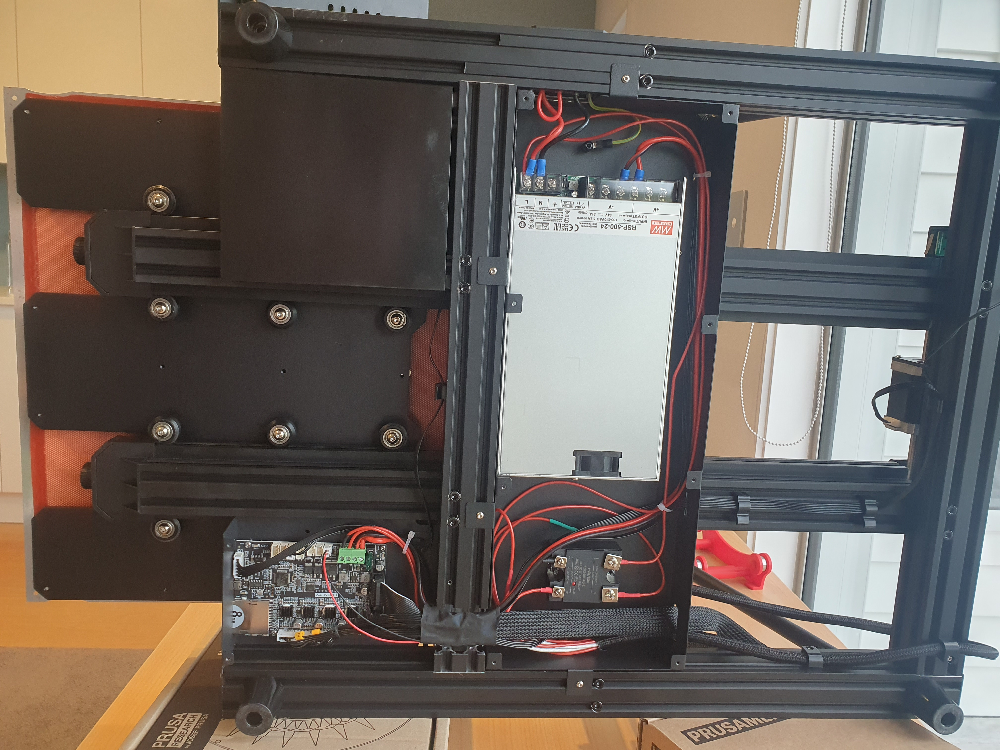

# Creality CR6Max Heat Bed Upgrade

## Disclaimer/Warning

Performing this heat bed upgrade should be done at your own risk as your dealing with Mains voltage which can kill.

## Problem

I upgraded my CR6 Max extruder to the Microswiss dual drive and hotend to enable higher temperatures for printing PETG.    This exposed the weakness of the CR6 Max heat bed being under powered at 420 watts and struggles to reach higher temperatures needed for printing PETG (80 degrees) or in my case ColorFabb HT which needs 110-120 degrees.   Whilst I could print PETG at 80 degrees it takes the printer 10+ minutes to heat up and over 20 minutes (and sometimes timing out in the firmware) when trying to reach 100 degrees.

My solution to this was to do the following heat bed upgrade using a Keenovo custom made silicone heater.    Originally my goal was to keep the same heat bed configuration allowing it to support both the factory glass top and a 4mm aluminum top with PEI sheet attach.  If I were to make a version 2 of this project I would instead have a 6mm aluminum bed machined and directly attach PEI sheet to be similar to the setup in a RatRig and not support the glass top.  This would however require a custom PEI sheet made to size which can be ordered from [ENERGTIC](https://energetic3d.aliexpress.com/store/4542004?spm=a2g0o.productlist.0.0.5e684144QTHPky).  I would make use of features in a Prusa Mk3 with by allowing location pins used for centering the PEI sheet when placing it on the heat bed.

## Files

The following files where used for manufacture and order of heatbed and heat pad.

* [cr6-max-heatbed.stl](cr6-max-heatbed.stl) Provides a 3D model of the factory heatbed that can be laser cut from aluminum sheet (4mm) by [pcbway.com](https://www.pcbway.com/rapid-prototyping/CNC-machining/CNC-Laser-Cutting-Services.html).   You could also get this cut by a similar service in your country.

* [cr6max-heatbed-r.pdf](cr6max-heatbed-r.pdf) Provides technical drawings for a custom heat pad manufactured by [Keenovo](https://www.keenovo.com/).  Contact them by email at sales@keenovo.com and ask for a quote for a custom heat pad.   Note that in my technical drawings it specifies 220volts where you may need 110volts depending on your location.

## Resources

* [Teaching Tech Upgrade Guide](https://youtu.be/1VyFejiKkSQ) - Video going through the process of how to upgrade your 3D printer bed using a Keenovo heat pad.
* [My wiring Schematic](cr6max-heatbed-schematic.jpg) - Drawing of my wiring schematic.

## Photos

